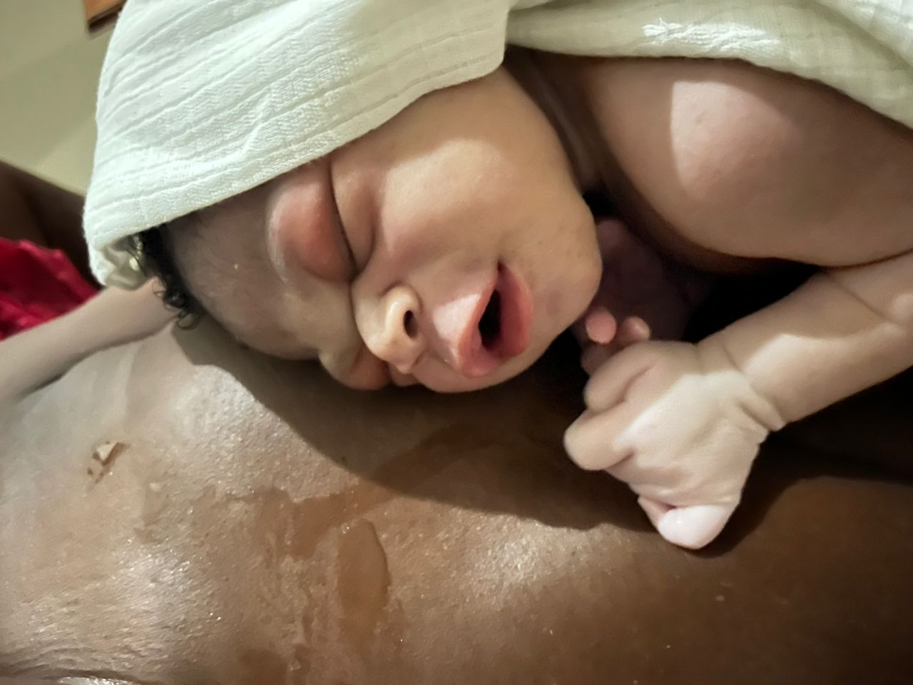

<html>
<body>
<h1>GCBC WhatsApp Archive</h1>

1/1/25, 1:51PM - Melinda Parenteau: Praying for a safe trip for you today Ninotte!!!

Happy New year everyone! What a privilege to work with. Each one of you. Was watching the real today and thinking about each face each person each story. That is so beyond our knowledge, but knowing that there is a whole person that we are reaching with each woman and family member that walks through our doors. Thanks for leading the way Ninotte

1/1/25, 6:45PM - Ninotte Lubin: Just made it back to grand Bassin 

Happy new year everyone! Such an incredible team!!!

Let’s keep moving forward. 2025 for better!!

Love you all

1/1/25, 6:46PM - Ninotte Lubin: Thank you Melinda!

1/1/25, 6:47PM - Craig Mulder: Happy New Year everyone.  Glad you made it back safely Ninotte!

1/1/25, 6:48PM - Craig Mulder: Melinda - that is a lovely reel you put together

1/4/25, 5:54PM - Ninotte Lubin:  (file attached)

1/4/25, 5:55PM - Ninotte Lubin: IMG-20250104-WA0001.jpg (file attached)

1/4/25, 5:55PM - Ninotte Lubin: First baby of the year

1/4/25, 5:55PM - Ninotte Lubin: A boy 

Long labor, 24+ hours

1/4/25, 5:55PM - Ninotte Lubin: IMG-20250104-WA0002.jpg (file attached)

1/4/25, 5:56PM - Ninotte Lubin: IMG-20250104-WA0003.jpg (file attached)

1/4/25, 5:56PM - Melinda Parenteau: Congratulations

1/4/25, 5:56PM - Ninotte Lubin: Lots of prenatal and postpartum today too

1/4/25, 6:00PM - Melinda Parenteau: Was this a class?

1/4/25, 6:22PM - Ninotte Lubin: Nope, prenatal and postpartum clients

1/5/25, 7:27PM - Ninotte Lubin: Second boy of the month

1/5/25, 7:27PM - Ninotte Lubin: IMG-20250105-WA0000.jpg (file attached)

1/5/25, 7:27PM - Ninotte Lubin: IMG-20250105-WA0001.jpg (file attached)

1/5/25, 7:27PM - Ninotte Lubin: IMG-20250105-WA0002.jpg (file attached)

1/10/25, 2:49PM - Ninotte Lubin: IMG-20250110-WA0001.jpg (file attached)

1/10/25, 2:49PM - Ninotte Lubin: IMG-20250110-WA0000.jpg (file attached)

1/10/25, 3:00PM - Ninotte Lubin: A third boy for the year

We had a girl last night, cord prolapse, heavy meconium. We managed to have the birth at the center be cause we could.

Birth happened, HPP and newborn resuscitation with transfer of the baby.

In the morning, mom left to breastfeed the baby as she got called then, around noon they called to say baby passed. 

We weren’t too surprised because she swallowed too much liquid. However, we managed to have her transferred with O2 and alive.

1/10/25, 3:01PM - Ninotte Lubin: And, the private hospital she went is not too equipped

1/10/25, 3:02PM - Ninotte Lubin: We are happy to finally have a birth that did not require too much of us.

1/10/25, 3:08PM - Lynette Biery: Glad you had a healing birth. Love and prayers to all.

1/10/25, 8:10PM - Melinda Parenteau: Wow! I'm so sorry to hear that.

1/11/25, 10:10AM - Ninotte Lubin: IMG-20250111-WA0000.jpg (file attached)

1/11/25, 10:10AM - Ninotte Lubin: IMG-20250111-WA0001.jpg (file attached)

1/11/25, 10:11AM - Ninotte Lubin: Another boy this early morning

1/12/25, 12:49PM - Melinda Parenteau: Jan 12th, a day to remember the loss of so many lives and much more 14 years ago. 

💔❤️💔❤️

1/12/25, 12:53PM - Kate Mazzara: Yes...and without the tragedy, we would not have met Ninotte. We would not have a beautiful birth center that will have a greater impact for generations to come. In God's name and grace.

1/12/25, 4:30PM - Ninotte Lubin: IMG-20250112-WA0001.jpg (file attached)

1/12/25, 4:30PM - Ninotte Lubin: IMG-20250112-WA0000.jpg (file attached)

1/12/25, 4:30PM - Ninotte Lubin: And, this beautiful girl born just now

1/12/25, 4:30PM - Ninotte Lubin: Yes, Kate 

Thank you 🙏

1/12/25, 4:31PM - Ninotte Lubin: 15 years ago Melinda 

Thank you 🙏

1/12/25, 8:37PM - Craig Mulder: So great to have such a beautiful spirit born on this day marking the anniversary of such an awful tragedy.

1/13/25, 3:40PM - Ninotte Lubin: IMG-20250113-WA0000.jpg (file attached)

1/13/25, 3:40PM - Ninotte Lubin: A boy

1/13/25, 10:18PM - Craig Mulder: Jonathan Katz, author of a recent book on Haiti, posted an essay in remembrance of the earthquake. It ends with this:

" But the reality is that, while yes, the problems are still there, the solutions are also still in reach. We just have to remember, once again, that lesson so many of us took on that awful night: Wherever we are, and whatever our station, we’re all in this together."

The entire essay is here: https://theracket.news/p/15-years-of-solitude-haiti-earthquake-anniversary

1/13/25, 10:32PM - Craig Mulder: To follow up, here's another essay, from The Guardian, that was written on the 10th anniversary of the earthquake. It recounts all the ways that international aid, primarily US, has harmed Haiti.

1/13/25, 10:32PM - Craig Mulder: https://www.theguardian.com/world/2019/oct/11/haiti-and-the-failed-promise-of-us-aid

1/14/25, 4:57PM - Ninotte Lubin: IMG-20250114-WA0000.jpg (file attached)

1/14/25, 4:57PM - Ninotte Lubin: IMG-20250114-WA0001.jpg (file attached)

1/14/25, 4:57PM - Ninotte Lubin: It’s a girl

1/14/25, 4:58PM - Ninotte Lubin: IMG-20250114-WA0002.jpg (file attached)

1/14/25, 4:58PM - Ninotte Lubin: And another woman in labor

1/14/25, 5:32PM - Melinda Parenteau: What a busy week

1/15/25, 10:21AM - Ninotte Lubin: IMG-20250115-WA0000.jpg (file attached)

1/15/25, 10:21AM - Ninotte Lubin: IMG-20250115-WA0001.jpg (file attached)

1/15/25, 10:25AM - Ninotte Lubin: Born last night, a boy

Complete breech with neonatal resuscitation including the use of O2. We didn’t transfer as baby came out well, crying and breastfeeding. 

Another difficult one but great after all 

January 2025 is something, we can say

1/15/25, 10:33AM - Melinda Parenteau: Wow!!!!

1/16/25, 7:02AM - Ninotte Lubin: IMG-20250116-WA0000.jpg (file attached)

1/16/25, 7:02AM - Ninotte Lubin: IMG-20250116-WA0001.jpg (file attached)

1/16/25, 7:02AM - Ninotte Lubin: IMG-20250116-WA0002.jpg (file attached)

1/16/25, 7:03AM - Ninotte Lubin: 3 babies born in 8 hours 

2 boys and a girl

All three healthy

1/16/25, 7:05AM - Ninotte Lubin: We had to use the prenatal room that’s also considered the sleeping area for the staff for the 3rd birth. 

From 10 last night till 6 this morning for the last one, no time to breathe. 

Happy that they were all great and short birth

1/16/25, 7:07AM - Ninotte Lubin: IMG-20250116-WA0003.jpg (file attached)

1/16/25, 7:08AM - Ninotte Lubin: Lourdie the nurse doing postpartum instructions for the one in the prenatal room

1/16/25, 7:13AM - Ninotte Lubin: Good morning everyone 

Hope you all have a great morning!

1/16/25, 8:01AM - Kate Mazzara: Will you all be able to get some rest, or is it a busy clinic day as well.

1/16/25, 8:02AM - Craig Mulder: What an incredible night! Great work all! 👍

1/16/25, 8:37AM - Ninotte Lubin: Busy clinic day unfortunately 

We’ll do well

Thank you!

1/16/25, 9:06AM - Kate Mazzara: Maybe you can take turns naming. Stong work team!

1/16/25, 9:14AM - Ninotte Lubin: We will 

Thank you 🙏

1/16/25, 10:57AM - Melinda Parenteau: Wow! What a night! The day goes smoothly for you and you guys all get

1/17/25, 10:25AM - Ninotte Lubin: IMG-20250117-WA0000.jpg (file attached)

1/17/25, 10:26AM - Ninotte Lubin: A girl

1/17/25, 10:27AM - Ninotte Lubin: And a HBP in early labor transfer around 4 thin morning

1/17/25, 10:27AM - Ninotte Lubin: We were able to get some sleep before 10 pm last night when the one we transferred arrived

1/17/25, 10:28AM - Ninotte Lubin: Thank you 🙏

1/19/25, 2:26PM - Ninotte Lubin: 2 boys

1/19/25, 2:27PM - Ninotte Lubin: IMG-20250119-WA0000.jpg (file attached)

1/19/25, 2:27PM - Ninotte Lubin: IMG-20250119-WA0001.jpg (file attached)

1/19/25, 2:28PM - Ninotte Lubin: One has been at the center past 24 hours

The other arrived then birthed after 21 minutes

1/19/25, 2:43PM - Craig Mulder: What a difference! Congratulations on two more

1/19/25, 3:29PM - Melinda Parenteau: Yay!

1/22/25, 2:47PM - Ninotte Lubin: IMG-20250122-WA0000.jpg (file attached)

1/22/25, 2:47PM - Ninotte Lubin: After 24 hours of hard labor

A boy and a strong young woman, 17 years old

1/22/25, 3:06PM - Lynette Biery: Wow!!! Great work! I’m tired for you all.

1/25/25, 8:08AM - Ninotte Lubin: IMG-20250125-WA0000.jpg (file attached)

1/25/25, 8:08AM - Ninotte Lubin: IMG-20250125-WA0001.jpg (file attached)

1/25/25, 8:09AM - Ninotte Lubin: Two more babies, a boy and a girl

1/25/25, 5:33PM - Ninotte Lubin: IMG-20250125-WA0002.jpg (file attached)

1/25/25, 5:33PM - Ninotte Lubin: Another boy

1/27/25, 3:04PM - Ninotte Lubin: IMG-20250127-WA0000.jpg (file attached)

1/27/25, 3:05PM - Ninotte Lubin: A girl

1/28/25, 9:24AM - Craig Mulder: Thank you for sending these lovely photos Ninotte.

1/28/25, 9:43AM - Craig Mulder: On Feb 20 our local college is hosting Monique Clesca and Jake Johnston to talk about Haiti. See this page for more info - https://www.tciaf.com/event-february-2025.   Ms. Clesca is a Haitian journalist and has been an advocate for an alternative approach to handling Haiti's governance issues. I came across this video on the Montana Accord and wanted to pass it on to you all - https://akomontana.ht/en/home/   Ninotte - I'd really like to hear what you think of the video.

1/28/25, 9:56AM - Ninotte Lubin: IMG-20250128-WA0000.jpg (file attached)

1/28/25, 9:56AM - Ninotte Lubin: IMG-20250128-WA0001.jpg (file attached)

1/28/25, 9:57AM - Ninotte Lubin: 2 more babies this morning

1/28/25, 9:59AM - Ninotte Lubin: Prenatal class happening right now

1/28/25, 9:59AM - Ninotte Lubin: IMG-20250128-WA0002.jpg (file attached)

1/28/25, 9:59AM - Ninotte Lubin: IMG-20250128-WA0003.jpg (file attached)

1/28/25, 10:00AM - Ninotte Lubin: We have to have a bed at the office for a postpartum

1/28/25, 10:01AM - Ninotte Lubin: IMG-20250128-WA0004.jpg (file attached)

1/28/25, 10:01AM - Ninotte Lubin: While another one in labor, walking

1/28/25, 10:02AM - Ninotte Lubin: IMG-20250128-WA0005.jpg (file attached)

1/28/25, 10:02AM - Ninotte Lubin: 50 women attending class today

1/28/25, 10:03AM - Craig Mulder: Very impressive!

1/28/25, 10:53AM - Ninotte Lubin: Just born 

A girl

1/28/25, 10:53AM - Ninotte Lubin: IMG-20250128-WA0006.jpg (file attached)

1/28/25, 10:53AM - Ninotte Lubin: IMG-20250128-WA0007.jpg (file attached)

1/28/25, 10:54AM - Ninotte Lubin: What a busy night and morning 

3 births

1/28/25, 11:34AM - Ninotte Lubin: IMG-20250128-WA0008.jpg (file attached)

1/28/25, 11:45AM - Melinda Parenteau: Wow! What a busy week! Looking forward to posting a much of these pictures very soon

1/28/25, 11:46AM - Ninotte Lubin: IMG-20250128-WA0009.jpg (file attached)

1/28/25, 11:46AM - Ninotte Lubin: IMG-20250128-WA0010.jpg (file attached)

1/28/25, 12:13PM - Craig Mulder: Yum!

1/30/25, 8:30PM - Craig Mulder: Great Instagram reel Melinda!

1/31/25, 7:35AM - Ninotte Lubin: IMG-20250131-WA0000.jpg (file attached)

1/31/25, 7:36AM - Ninotte Lubin: She might be the last one of January but who knows what can happen before midnight!!!

24 births!!!!!!

1/31/25, 7:36AM - Ninotte Lubin: Good morning all!

1/31/25, 8:17AM - Craig Mulder: Good morning to all of you! That is a lot of births!

1/31/25, 10:16AM - Melinda Parenteau: Wowwowow

1/31/25, 10:16AM - Melinda Parenteau: Record settings

2/1/25, 1:05PM - Ninotte Lubin: IMG-20250201-WA0001.jpg (file attached)

2/1/25, 1:05PM - Ninotte Lubin: IMG-20250201-WA0000.jpg (file attached)

2/1/25, 1:05PM - Ninotte Lubin: IMG-20250201-WA0002.jpg (file attached)

2/1/25, 1:05PM - Ninotte Lubin: IMG-20250201-WA0003.jpg (file attached)

2/1/25, 1:06PM - Ninotte Lubin: IMG-20250201-WA0004.jpg (file attached)

2/1/25, 1:07PM - Ninotte Lubin: Sexual Ed class of today

50 presents 

Boys and girls 

We watched a movie that thought about sexual violence

2/1/25, 9:48PM - Ninotte Lubin: IMG-20250201-WA0006.jpg (file attached)

2/1/25, 9:48PM - Ninotte Lubin: First February birth 

A girl

2/1/25, 9:48PM - Ninotte Lubin: IMG-20250201-WA0007.jpg (file attached)

2/1/25, 9:53PM - Craig Mulder: What a great 1st of February

2/1/25, 9:59PM - Kate Mazzara: My sister in laws birthday

2/3/25, 10:28PM - Ninotte Lubin: IMG-20250203-WA0001.jpg (file attached)

2/3/25, 10:28PM - Ninotte Lubin: IMG-20250203-WA0000.jpg (file attached)

2/3/25, 10:28PM - Ninotte Lubin: A boy and a girl tonight

2/3/25, 11:41PM - Ninotte Lubin: IMG-20250203-WA0002.jpg (file attached)

2/3/25, 11:41PM - Ninotte Lubin: IMG-20250203-WA0003.jpg (file attached)

2/4/25, 10:07AM - Ninotte Lubin: IMG-20250204-WA0000.jpg (file attached)

2/4/25, 10:07AM - Ninotte Lubin: Girl

2/4/25, 10:29AM - Ninotte Lubin: IMG-20250204-WA0001.jpg (file attached)

2/4/25, 8:53PM - Ninotte Lubin: IMG-20250204-WA0002.jpg (file attached)

2/4/25, 8:54PM - Ninotte Lubin: Another girl born just now

2/4/25, 8:54PM - Ninotte Lubin: 2 girls on your birthday Kate

2/4/25, 8:54PM - Craig Mulder: Lots of beautiful babies!!

2/4/25, 8:55PM - Ninotte Lubin: Yes 

Thanks Craig!

2/4/25, 9:28PM - Melinda Parenteau: Well done! And happy birthday Kate!

2/5/25, 7:15AM - Ninotte Lubin: IMG-20250205-WA0000.jpg (file attached)

2/5/25, 7:15AM - Ninotte Lubin: A boy

2/5/25, 7:33AM - Lynette Biery: The Buddha is born again. I hope you all get some rest.

2/6/25, 5:19PM - Ninotte Lubin: IMG-20250206-WA0000.jpg (file attached)

2/6/25, 5:20PM - Ninotte Lubin: 7th birth in 6 days

2/6/25, 5:20PM - Ninotte Lubin: IMG-20250206-WA0001.jpg (file attached)

2/6/25, 5:20PM - Ninotte Lubin: Happy family

2/6/25, 6:58PM - Craig Mulder: 🙂

2/7/25, 7:59AM - Ninotte Lubin: IMG-20250207-WA0000.jpg (file attached)

2/7/25, 8:00AM - Ninotte Lubin: A girl, born this morning

2/9/25, 3:32PM - Melinda Parenteau: I just heard about the earthquake that happened in the middle of the ocean, right in the dead center of the Caribbean islands. Did you feel any effect in Haiti? They're talking about threat of tsunami

2/9/25, 3:35PM - Ninotte Lubin: I don’t know if anyone else felt it but no for us. I’ve heard alerts on the threat of tsunami as you  mentioned

2/9/25, 3:35PM - Melinda Parenteau: Okay that's good to hear. How are things going down there for you guys?

2/9/25, 3:40PM - Ninotte Lubin: We are well, no births for the past couple days but we have 18 more due dates for this month

2/9/25, 4:29PM - Craig Mulder: Glad to hear you all are OK

2/10/25, 12:52PM - Ninotte Lubin: IMG-20250210-WA0000.jpg (file attached)

2/10/25, 12:52PM - Ninotte Lubin: A boy after a break of 48 hours

2/11/25, 11:18AM - Ninotte Lubin: Prenatal education 

Topic: Labor and birth 

30 women present

2/11/25, 11:18AM - Ninotte Lubin: IMG-20250211-WA0000.jpg (file attached)

2/11/25, 11:18AM - Ninotte Lubin: IMG-20250211-WA0001.jpg (file attached)

2/11/25, 11:58AM - Ninotte Lubin: IMG-20250211-WA0002.jpg (file attached)

2/11/25, 11:58AM - Ninotte Lubin: IMG-20250211-WA0003.jpg (file attached)

2/11/25, 11:58AM - Ninotte Lubin: IMG-20250211-WA0004.jpg (file attached)

2/11/25, 12:18PM - Melinda Parenteau: This is awesome

2/11/25, 12:36PM - Ninotte Lubin: IMG-20250211-WA0005.jpg (file attached)

2/16/25, 11:50AM - Ninotte Lubin: IMG-20250216-WA0000.jpg (file attached)

2/16/25, 11:50AM - Ninotte Lubin: Good morning all

It’s been a few days without a birth 

This one arrived this morning 

A boy

2/16/25, 11:54AM - Melinda Parenteau: Yay!

2/16/25, 11:56AM - Craig Mulder: I love the photo

2/16/25, 12:42PM - Ninotte Lubin: IMG-20250216-WA0001.jpg (file attached)

2/16/25, 12:57PM - Ninotte Lubin: Postpartum education by our nurse Lourdie

2/16/25, 12:57PM - Ninotte Lubin: IMG-20250216-WA0002.jpg (file attached)

2/17/25, 12:43PM - Ninotte Lubin: IMG-20250217-WA0000.jpg (file attached)

2/17/25, 12:43PM - Ninotte Lubin: IMG-20250217-WA0001.jpg (file attached)

2/17/25, 12:44PM - Ninotte Lubin: A boy and a girl 

Both born this morning

2/17/25, 12:51PM - Craig Mulder: 🙂❤️

2/19/25, 9:20AM - Ninotte Lubin: IMG-20250219-WA0000.jpg (file attached)

2/19/25, 9:20AM - Ninotte Lubin: IMG-20250219-WA0001.jpg (file attached)

2/19/25, 9:20AM - Ninotte Lubin: 2 babies born early this morning 

A boy and a girl

2/19/25, 9:34AM - Craig Mulder: Very special! 🙂

2/19/25, 9:50AM - Kate Mazzara: Your bees 🐝 got nothing on you. You are a busy

2/19/25, 9:50AM - Kate Mazzara: Bee

2/20/25, 8:15AM - Ninotte Lubin: IMG-20250220-WA0000.jpg (file attached)

2/20/25, 8:15AM - Ninotte Lubin: Good morning 

I am a girl 🧒

2/20/25, 9:06AM - Craig Mulder: Welcome sweetie

2/20/25, 9:46AM - Kate Mazzara: Yeah you are!!

2/23/25, 11:46AM - Craig Mulder: Kathi's mom, Carolyn McDonald, died this Friday evening, surrounded by many family members. She had a peaceful death. She was 88 years old. Kathi's father, Robert (Bob) is still with us.

2/23/25, 11:56AM - Melinda Parenteau: Wow. Strength and comfort to you and Kathi. She was so blessed to have a devoted daughter, son-in-law and other family by her side. You guys are such a testament of what a beautiful family can be. 

I hope this week is filled with sweet memories along with the grief and the fatigue

2/23/25, 11:59AM - Kate Mazzara: I echo Melinda's thoughts and add my heart is with you 💓

2/23/25, 12:23PM - Ninotte Lubin: Oh no! My heart is with you in this difficult time 

Strength, comfort and love ❤️

2/24/25, 9:42AM - Ninotte Lubin: IMG-20250224-WA0000.jpg (file attached)

2/24/25, 9:42AM - Ninotte Lubin: Good morning 🌞 

A boy

2/25/25, 10:30AM - Ninotte Lubin: IMG-20250225-WA0000.jpg (file attached)

2/25/25, 10:31AM - Ninotte Lubin: IMG-20250225-WA0001.jpg (file attached)

2/25/25, 10:31AM - Ninotte Lubin: 2 boys

2/25/25, 10:31AM - Ninotte Lubin: IMG-20250225-WA0002.jpg (file attached)

2/25/25, 10:31AM - Ninotte Lubin: And prenatal class this morning

2/25/25, 11:10AM - Ninotte Lubin: IMG-20250225-WA0003.jpg (file attached)

2/25/25, 11:10AM - Ninotte Lubin: IMG-20250225-WA0004.jpg (file attached)

2/25/25, 11:10AM - Ninotte Lubin: IMG-20250225-WA0005.jpg (file attached)

2/25/25, 11:24AM - Ninotte Lubin: She’s so happy thinking us for the care she got. Long and difficult labor, High blood pressure, long pushing time and HPP

35 years old, G3

2/25/25, 11:24AM - Ninotte Lubin: IMG-20250225-WA0006.jpg (file attached)

2/25/25, 2:13PM - Ninotte Lubin: Thanking I meant

3/1/25, 8:30AM - Ninotte Lubin: Good morning all

February brought the last baby girl yesterday 

20 births on site

5 women delivered at home

6 referrals including 1 still birth and 1 neonatal death

Thank you for everything!

3/1/25, 8:31AM - Ninotte Lubin: IMG-20250301-WA0000.jpg (file attached)

3/1/25, 8:32AM - Craig Mulder: Ready to get out in the world!

3/1/25, 8:33AM - Lynette Biery: Someone dim the lights for that sweet baby girl…she needs a minute. 😃 Great work, Ninotte and all!

3/2/25, 1:09PM - Ninotte Lubin: IMG-20250302-WA0000.jpg (file attached)

3/2/25, 1:09PM - Ninotte Lubin: 1st baby of March

A boy

3/6/25, 1:46PM - Ninotte Lubin: IMG-20250306-WA0000.jpg (file attached)

3/6/25, 1:46PM - Ninotte Lubin: IMG-20250306-WA0001.jpg (file attached)

3/6/25, 1:46PM - Ninotte Lubin: Two girls 

Just born an hour apart

3/7/25, 4:39PM - Ninotte Lubin: IMG-20250307-WA0000.jpg (file attached)

3/7/25, 4:40PM - Ninotte Lubin: Baby girl today

3/8/25, 8:42AM - Ninotte Lubin: IMG-20250308-WA0000.jpg (file attached)

3/8/25, 8:43AM - Ninotte Lubin: IMG-20250308-WA0001.jpg (file attached)

3/8/25, 8:43AM - Ninotte Lubin: A boy born last night

3/8/25, 9:40AM - Craig Mulder: Great looking babies!

3/10/25, 12:48PM - Melinda Parenteau: If I happen to be a couple minutes late it is because I am nursing Jack to sleep. I will join the meeting as soon as I can

3/10/25, 1:19PM - Melinda Parenteau: Craig could you send me the documents you sent yesterday? I don't see them in my email

3/10/25, 1:19PM - Kate Mazzara: There is a link in the agenda

3/10/25, 3:31PM - Lynette Biery: Melinda and Craig, do you want to forward any notes you did take and I’ll incorporate into mine?

3/10/25, 3:31PM - Melinda Parenteau: Unfortunately I wasn't able to take but after you put yours forward I could add to those from memory

3/10/25, 3:32PM - Lynette Biery: Will do.

3/10/25, 3:37PM - Craig Mulder: I didn't take any

3/10/25, 3:38PM - Craig Mulder: But I'll provide my summary of our decision and discussion

3/10/25, 6:42PM - Ninotte Lubin: IMG-20250310-WA0000.jpg (file attached)

3/10/25, 6:43PM - Ninotte Lubin: A fatty girl, just arrived

3/11/25, 8:13PM - Ninotte Lubin: IMG-20250311-WA0000.jpg (file attached)

3/11/25, 8:13PM - Ninotte Lubin: Girl

3/12/25, 5:39PM - Ninotte Lubin: IMG-20250312-WA0000.jpg (file attached)

3/12/25, 5:39PM - Ninotte Lubin: I received those supplies including 2 small O2 tanks from Cap Haitian Health Network today

3/12/25, 5:39PM - Ninotte Lubin: So great to get those especially the O2 tanks

3/12/25, 5:46PM - Kate Mazzara: What other supplies did you get?  It's like christmas 🎄 ☺️

3/12/25, 5:47PM - Ninotte Lubin: I haven’t opened yet

I’ll send a list later

3/12/25, 6:01PM - Melinda Parenteau: Is one of those tanks the one we bought or did the Haitian helps Network provide us both those tanks?

3/12/25, 6:15PM - Ninotte Lubin: I made a request for 1 

We received 2 added to what we bought 

Now we have 3

3/12/25, 6:43PM - Melinda Parenteau: Also, we did actually get that oxygen tank from that guy. We gave the 300 like months and months and months ago?

3/12/25, 6:59PM - Ninotte Lubin: I still didn’t receive that tank from the person in the Dominican Republic 

Hoping to receive it some day as she told me she will send it

3/13/25, 9:25AM - Ninotte Lubin: IMG-20250313-WA0000.jpg (file attached)

3/13/25, 9:25AM - Ninotte Lubin: So cozy sleeping while baby is breastfeeding

3/13/25, 9:26AM - Ninotte Lubin: IMG-20250313-WA0001.jpg (file attached)

3/13/25, 9:26AM - Ninotte Lubin: A boy

3/15/25, 9:27AM - Ninotte Lubin: IMG-20250315-WA0000.jpg (file attached)

3/15/25, 9:27AM - Ninotte Lubin: IMG-20250315-WA0001.jpg (file attached)

3/15/25, 9:27AM - Ninotte Lubin: Good morning 

I am a boy

3/15/25, 1:42PM - Melinda Parenteau: Aweee

3/16/25, 11:42AM - Ninotte Lubin: Good morning all

HDI team is coming to visit Grace tomorrow, I just received the message

3/16/25, 11:48AM - Craig Mulder: That's not very muc advance notice. I was planning to work on the report we owe HDI for the end of the grant period. It ended Feb 28. I'll send that to you, Ninotte, and to HDI.

3/16/25, 12:19PM - Ninotte Lubin: I thought of that

Thank you Craig!

3/19/25, 2:38PM - Ninotte Lubin: IMG-20250319-WA0000.jpg (file attached)

3/19/25, 2:38PM - Ninotte Lubin: IMG-20250319-WA0001.jpg (file attached)

3/19/25, 2:38PM - Ninotte Lubin: A girl

3/19/25, 2:48PM - Craig Mulder: Awake and ready for the world!

3/20/25, 12:03PM - Melinda Parenteau: Good morning, just clarifying is the meeting this Saturday? I just saw the email but wanted to clarify it's Saturday and not Friday

3/20/25, 12:06PM - Kathi Mulder: Meeting is Friday but I see I put 2/21 so will correct that

3/20/25, 12:08PM - Melinda Parenteau: Okay thanks Kathy

3/20/25, 9:11PM - Ninotte Lubin: IMG-20250320-WA0001.jpg (file attached)

3/20/25, 9:11PM - Ninotte Lubin: IMG-20250320-WA0002.jpg (file attached)

3/20/25, 9:12PM - Ninotte Lubin: A girl

3/20/25, 9:13PM - Kate Mazzara: IMG-20250320-WA0003.jpg (file attached)

Love the picture on top. It says why did you do that....my dog gives the same look

3/25/25, 1:11PM - Ninotte Lubin: IMG-20250325-WA0000.jpg (file attached)

3/25/25, 1:11PM - Ninotte Lubin: IMG-20250325-WA0001.jpg (file attached)

3/25/25, 1:11PM - Ninotte Lubin: A boy

3/25/25, 1:12PM - Ninotte Lubin: IMG-20250325-WA0002.jpg (file attached)

3/25/25, 1:12PM - Ninotte Lubin: Prenatal class today on Nutrition

3/25/25, 1:13PM - Ninotte Lubin: 55 women present

3/25/25, 1:19PM - Ninotte Lubin: IMG-20250325-WA0003.jpg (file attached)

3/25/25, 1:19PM - Ninotte Lubin: IMG-20250325-WA0004.jpg (file attached)

Motorcycle parking lot

3/25/25, 1:19PM - Ninotte Lubin: IMG-20250325-WA0005.jpg (file attached)

3/25/25, 1:20PM - Ninotte Lubin: IMG-20250325-WA0006.jpg (file attached)

3/26/25, 9:29AM - Ninotte Lubin: I am a girl

3/26/25, 9:30AM - Craig Mulder: I love the photos!

3/26/25, 9:34AM - Kate Mazzara: So Ninotte your pronouns are she/her 😉

3/26/25, 9:39AM - Ninotte Lubin: IMG-20250326-WA0001.jpg (file attached)

3/26/25, 9:39AM - Ninotte Lubin: IMG-20250326-WA0000.jpg (file attached)

3/26/25, 9:47AM - Ninotte Lubin: Yes, Kate

3/26/25, 9:55AM - Kate Mazzara: There she is

3/28/25, 6:41AM - Lynette Biery: Ninotte, I’m working on the Grace at Year Two document…is 55 women at a prenatal class an average number? I want to say roughly how many women have been served by classes. Or do you know that?

3/28/25, 6:45AM - Ninotte Lubin: 55 from the ages of 16 to 39

3/28/25, 6:46AM - Ninotte Lubin: We don’t always have that number at each class

The average number is around 30

3/28/25, 6:46AM - Lynette Biery: Perfect. Thanks for your quick reply. 😊

3/28/25, 6:59AM - Lynette Biery: Is the # 104 for cervical cancer treatment include women screened who didn’t need treatment?

3/28/25, 7:00AM - Ninotte Lubin: 104 is for treatment 

I have to look at the total number including the ones who didn’t need treatment

3/28/25, 7:02AM - Lynette Biery: If you could that would be great. It can be in the next several days. We can put an CX as a placeholder for now. Thanks.

3/28/25, 7:07AM - Ninotte Lubin: I’ll let you know in a bit

3/28/25, 7:07AM - Lynette Biery: 😊

3/29/25, 10:22AM - Ninotte Lubin: IMG-20250329-WA0000.jpg (file attached)

3/29/25, 10:22AM - Ninotte Lubin: IMG-20250329-WA0001.jpg (file attached)

3/29/25, 10:22AM - Ninotte Lubin: A girl

3/31/25, 8:24PM - Melinda Parenteau: Happy birthday Kathi! You have been our fearless (and even if fearful at times) have continued to be courageous, tenacious, gracious and strong through all the years I have known you! 

Many blessings on you this year and all the ones to come. We are so thankful for you and just getting to know who you are with each passing year.

3/31/25, 8:25PM - Kate Mazzara: Happy Birthday 🎂

3/31/25, 8:27PM - Lynette Biery: Well said, Melinda. ❤️❤️

4/1/25, 2:28PM - Kathi Mulder: Thank you all for the well wishes & kind words 🙏❤️

4/1/25, 5:27PM - Ninotte Lubin: IMG-20250401-WA0000.jpg (file attached)

4/1/25, 5:28PM - Ninotte Lubin: April fool’s baby girl arrived

4/1/25, 5:33PM - Melinda Parenteau: Yay

4/1/25, 5:33PM - Melinda Parenteau: She shares a birthday with Chris

4/1/25, 5:33PM - Ninotte Lubin: Sophia, 17 years old, came to us after moving to the Northern region because gangs killed her parents and raped her. Pregnant and homeless a client brought her to us. She received care for free and had her baby today

4/1/25, 5:34PM - Melinda Parenteau: What is the exact day we opened in April 2 years ago? I believe It was April 8th? And our first birth was April 28th?

4/1/25, 5:34PM - Melinda Parenteau: Oh my goodness no words

4/1/25, 5:34PM - Ninotte Lubin: April 10th

4/1/25, 5:34PM - Melinda Parenteau: Who is she living with? Does she have family up there?

4/1/25, 5:35PM - Ninotte Lubin: A woman in Trou du Nord let her stay with her

4/1/25, 5:35PM - Ninotte Lubin: No family

4/1/25, 5:35PM - Melinda Parenteau: Wow

4/1/25, 5:35PM - Melinda Parenteau: Is she being well care for by the lady?

4/1/25, 5:35PM - Melinda Parenteau: What a beautiful baby girl she is

4/1/25, 8:48PM - Ninotte Lubin: IMG-20250401-WA0001.jpg (file attached)

4/1/25, 9:27PM - Kate Mazzara: Oh my heart

4/2/25, 11:40AM - Kathi Mulder: So incredibly sad. Hopefully she can stay with that woman for awhile and your care & her birth will give her strength & courage to care for her baby

4/3/25, 11:24AM - Ninotte Lubin: IMG-20250403-WA0002.jpg (file attached)

4/3/25, 11:24AM - Ninotte Lubin: IMG-20250403-WA0000.jpg (file attached)

4/3/25, 11:25AM - Ninotte Lubin: IMG-20250403-WA0001.jpg (file attached)

4/3/25, 11:25AM - Ninotte Lubin: A girl

4/3/25, 11:39AM - Craig Mulder: ❤️

4/4/25, 6:33PM - Ninotte Lubin: IMG-20250404-WA0000.jpg (file attached)

4/4/25, 6:33PM - Ninotte Lubin: IMG-20250404-WA0001.jpg (file attached)

4/4/25, 6:33PM - Ninotte Lubin: IMG-20250404-WA0002.jpg (file attached)

4/4/25, 6:33PM - Ninotte Lubin: A girl

4/6/25, 8:06PM - Ninotte Lubin: Hi everyone 

Hope you are all doing well 

The FAHM workshop on cervical cancer screening and treatment will happen from tomorrow the 7th to the 10th. 

It’s at the midwifery campus in Limonade, not too far from us. I will go with Rose-Merline back and forth every day.

Just let you all know that 

Thank you 🙏

4/6/25, 8:52PM - Kathi Mulder: Thanks for reminding us Ninotte. I hope it goes well. Let’s plan for you & I to have a phone call on Friday.

4/7/25, 9:38PM - Ninotte Lubin: IMG-20250407-WA0000.jpg (file attached)

4/7/25, 9:38PM - Ninotte Lubin: IMG-20250407-WA0001.jpg (file attached)

4/7/25, 9:38PM - Ninotte Lubin: Born today 

A boy

4/10/25, 1:08PM - Ninotte Lubin: IMG-20250410-WA0000.jpg (file attached)

4/10/25, 1:08PM - Ninotte Lubin: IMG-20250410-WA0001.jpg (file attached)

4/10/25, 1:08PM - Ninotte Lubin: IMG-20250410-WA0002.jpg (file attached)

4/10/25, 1:08PM - Ninotte Lubin: Born this morning 

A boy

4/10/25, 1:22PM - Melinda Parenteau: Who is the staff sitting beside her? What a lovely shot. What are they talking about

4/10/25, 2:58PM - Ninotte Lubin: That’s Natacha

4/11/25, 8:42AM - Ninotte Lubin: IMG-20250411-WA0000.jpg (file attached)

4/11/25, 8:42AM - Ninotte Lubin: Boy

4/11/25, 10:10AM - Melinda Parenteau: Hi little guy

4/11/25, 10:10AM - Melinda Parenteau: Happy belated anniversary to Grace!!!!!! ❤️

4/12/25, 8:37AM - Ninotte Lubin: IMG-20250412-WA0000.jpg (file attached)

4/12/25, 8:38AM - Ninotte Lubin: IMG-20250412-WA0001.jpg (file attached)

4/12/25, 8:38AM - Ninotte Lubin: Girl

4/12/25, 8:31PM - Ninotte Lubin: IMG-20250412-WA0002.jpg (file attached)

4/12/25, 8:31PM - Ninotte Lubin: A boy

4/12/25, 10:17PM - Ninotte Lubin: IMG-20250412-WA0003.jpg (file attached)

4/12/25, 10:17PM - Ninotte Lubin: The third baby of the day

A boy

4/12/25, 10:17PM - Craig Mulder: Wow!

4/12/25, 10:18PM - Lynette Biery: Oh baby!!! I hope ya get some rest.

4/12/25, 10:29PM - Melinda Parenteau: Oh my goodness

4/17/25, 9:13AM - Ninotte Lubin: IMG-20250417-WA0000.jpg (file attached)

4/17/25, 9:13AM - Ninotte Lubin: IMG-20250417-WA0001.jpg (file attached)

4/17/25, 9:13AM - Ninotte Lubin: A boy

4/17/25, 9:15AM - Craig Mulder: He says: "Why did I have to come out already? I was enjoying where I was!"

4/17/25, 9:18AM - Ninotte Lubin: Yes!!!

4/20/25, 4:19PM - Ninotte Lubin: 2 girls born this afternoon 

I was not around. I went to buy water when a tire had a bad issue. I stayed a couple hours before I could get it fixed to get back to the center. 

However, the tire axis needs to be replaced. 

I’ll find out tomorrow the cost

4/20/25, 4:19PM - Ninotte Lubin: IMG-20250420-WA0000.jpg (file attached)

4/20/25, 4:19PM - Ninotte Lubin: IMG-20250420-WA0001.jpg (file attached)

4/20/25, 4:21PM - Ninotte Lubin: They were born in less than 2 hours

4/20/25, 4:21PM - Ninotte Lubin: A third one is walking

4/20/25, 4:21PM - Ninotte Lubin: IMG-20250420-WA0002.jpg (file attached)

4/20/25, 4:45PM - Melinda Parenteau: What a beautiful Day on Resurrection Sunday to have three new lives!

4/21/25, 7:45AM - Ninotte Lubin: The third  labor a girl born around midnight

4/21/25, 7:45AM - Ninotte Lubin: IMG-20250421-WA0000.jpg (file attached)

4/21/25, 7:45AM - Ninotte Lubin: IMG-20250421-WA0001.jpg (file attached)

4/21/25, 8:42AM - Lynette Biery: Sorry hear you had to deal with the truck. Welcome babies.

4/21/25, 10:56AM - Ninotte Lubin: Busy busy 

A girl

4/21/25, 10:59AM - Ninotte Lubin: IMG-20250421-WA0002.jpg (file attached)

4/21/25, 10:59AM - Ninotte Lubin: Plus that one

4/21/25, 10:59AM - Ninotte Lubin: IMG-20250421-WA0003.jpg (file attached)

4/21/25, 5:55PM - Ninotte Lubin: Another girl

4/21/25, 5:56PM - Craig Mulder: The truck needs a new wheel hub and bearing.  The cost is 45000 HTG for the part (about $350 USD) plus mechanic charges. I told her to go ahead since I didn't see any alternatives.

4/21/25, 5:58PM - Ninotte Lubin: IMG-20250421-WA0007.jpg (file attached)

4/22/25, 12:02PM - Craig Mulder: Such a serene face! 🙂

4/22/25, 5:43PM - Kate Mazzara: She looks like she is meditating

4/23/25, 11:36AM - Ninotte Lubin: IMG-20250423-WA0000.jpg (file attached)

4/23/25, 11:36AM - Ninotte Lubin: IMG-20250423-WA0001.jpg (file attached)

4/23/25, 11:37AM - Ninotte Lubin: Happy mom and her baby boy

4/23/25, 4:43PM - Ninotte Lubin: IMG-20250423-WA0002.jpg (file attached)

4/23/25, 4:43PM - Ninotte Lubin: Another boy

4/23/25, 4:58PM - Kate Mazzara: There is a population explosion at Grace!!

4/23/25, 5:00PM - Melinda Parenteau: How many in the last week?

4/23/25, 5:11PM - Ninotte Lubin: 7 babies in 36 hours

4/23/25, 5:23PM - Kate Mazzara: 🫠

4/23/25, 6:36PM - Melinda Parenteau: What?!?!?! 🤯

4/23/25, 6:36PM - Melinda Parenteau: Use of action around the center like a bunch of people present, walking around or a clump of babies and moms together. Something that would exemplify how busy it is

4/23/25, 6:36PM - Melinda Parenteau: Sorry I was saying can you get a bunch of pictures like I'm describing above

4/23/25, 6:36PM - Melinda Parenteau: My presentation is coming up

4/24/25, 8:06AM - Ninotte Lubin: IMG-20250424-WA0000.jpg (file attached)

4/24/25, 8:07AM - Ninotte Lubin: Girl

4/25/25, 9:39AM - Lynette Biery: Ninotte, I hope you are getting some rest. Such beautiful babies. The pictures Melinda describes would be great. Also, remember I’d like a description of a birth from the midwife/nurse’s perspective, done in a time line, comments from mom/family are welcome too. I need this by 4/30 to have ready for 5/5.

4/25/25, 10:56AM - Craig Mulder: IMG-20250425-WA0000.jpg (file attached)

4/25/25, 10:56AM - Craig Mulder: You know I would like to purchase three of these for the center. I support the purchase. How about the rest of you?

4/25/25, 10:57AM - Lynette Biery: Sure, if shipping is feasible and affordable.

4/25/25, 10:58AM - Craig Mulder: I think these are for sale in Haiti

4/25/25, 11:02AM - Melinda Parenteau: Agreed

4/25/25, 11:26AM - Kate Mazzara: What is the benefit of them being rechargeable as a posed to plug in. Just a ? For understanding.

4/25/25, 11:29AM - Ninotte Lubin: Fits for the solar system

4/25/25, 11:30AM - Craig Mulder: Good idea Ninotte!

4/25/25, 11:30AM - Kate Mazzara: Perfect thanks.  I thought that was the case...

Absolutely we should 

Will the come out of supply budget

4/25/25, 11:34AM - Craig Mulder: Go ahead and purchase Ninotte.  The expense will be listed as a supply rather than equipment since the cost is under $1000. But I don't see it being part of the maternal supplies budget that we have set up.

4/25/25, 11:46AM - Kate Mazzara: So, it's not the quarterly supply budget that is $1,000 for midwifery/office supplies? Correct

4/26/25, 2:02PM - Ninotte Lubin: IMG-20250426-WA0000.jpg (file attached)

4/26/25, 2:02PM - Ninotte Lubin: Big girl

4/26/25, 6:39PM - Kate Mazzara: PTT-20250426-WA0001.opus (file attached)

4/27/25, 7:34PM - Ninotte Lubin: IMG-20250427-WA0000.jpg (file attached)

4/27/25, 7:36PM - Ninotte Lubin: We had two births today, both boys. 

Had to resuscitate one of them, transferred but died in the hospital.

4/27/25, 9:14PM - Lynette Biery: Oh, I’m sorry yo hear this.

4/27/25, 9:20PM - Kate Mazzara: Tragic....I am so sorry 😞

4/27/25, 9:31PM - Craig Mulder: 😥

4/29/25, 10:24AM - Ninotte Lubin: IMG-20250429-WA0000.jpg (file attached)

4/29/25, 10:25AM - Ninotte Lubin: He was so awake 

Sweet baby boy arrived this morning

4/29/25, 10:44AM - Kate Mazzara: So contemplative.

4/29/25, 8:27PM - Ninotte Lubin: As my contact in the DR never sent the O2 tank to me, I found one and bought it for GCBC as it meant to be. 

Now, we have the 3 small tank and a big one, all full.

4/29/25, 8:28PM - Ninotte Lubin: IMG-20250429-WA0001.jpg (file attached)

4/29/25, 8:28PM - Ninotte Lubin: IMG-20250429-WA0002.jpg (file attached)

4/29/25, 8:53PM - Kate Mazzara: 🥳

5/2/25, 8:40AM - Ninotte Lubin: A boy

5/2/25, 8:40AM - Ninotte Lubin: IMG-20250502-WA0000.jpg (file attached)

5/2/25, 2:06PM - Lynette Biery: Ninotte…please translate “You matter to Grace”. Thanks.

5/2/25, 2:24PM - Ninotte Lubin: “Ou se Zafè Grace”

5/2/25, 2:25PM - Ninotte Lubin: “Ou se Zafè Grace”

5/2/25, 6:47PM - Lynette Biery: Ninotte, any chance to get a picture of Lourdie by Sunday? Maybe you and Lourdie together would be good.

5/2/25, 6:48PM - Ninotte Lubin: She’ll come to work Sunday, we’ll do

5/2/25, 6:48PM - Lynette Biery: Thanks.

5/3/25, 12:41PM - Ninotte Lubin: IMG-20250503-WA0000.jpg (file attached)

5/3/25, 12:41PM - Ninotte Lubin: Second baby of May

A boy

5/3/25, 12:41PM - Lynette Biery: He’s not so sure yet about this place.

5/4/25, 7:33AM - Lynette Biery: Ninotte, can you send me the photos individually that are embedded in the Shelove document. Thanks

5/4/25, 7:47AM - Ninotte Lubin: IMG-20250504-WA0000.jpg (file attached)

5/4/25, 7:47AM - Ninotte Lubin: IMG-20250504-WA0001.jpg (file attached)

5/4/25, 7:47AM - Ninotte Lubin: Lourdie Charles Nurse

5/4/25, 7:47AM - Lynette Biery: Beautiful!!!

5/4/25, 12:06PM - Lynette Biery: Did you see this? I need these by late this evening. Thanks

5/4/25, 12:55PM - Ninotte Lubin: IMG-20250504-WA0002.jpg (file attached)

5/4/25, 12:55PM - Ninotte Lubin: IMG-20250504-WA0003.jpg (file attached)

5/4/25, 12:56PM - Ninotte Lubin: IMG-20250504-WA0004.jpg (file attached)

5/4/25, 12:56PM - Ninotte Lubin: IMG-20250504-WA0005.jpg (file attached)

5/4/25, 12:58PM - Ninotte Lubin: IMG-20250504-WA0006.jpg (file attached)

Here’s a picture of a cervical cancer screening woman answering questions before the screening 

Chinaydine is a 3 month postpartum woman, delivered at GCBC

5/4/25, 3:48PM - Ninotte Lubin: 10 cervical screening including 5 treatments 

And a long labor and birth

5/4/25, 3:49PM - Ninotte Lubin: IMG-20250504-WA0007.jpg (file attached)

5/4/25, 3:49PM - Ninotte Lubin: A girl

5/5/25, 7:06AM - Lynette Biery: Ninotte, thank you for the photos. I need these one of just Esther after birth. It is in the document if you need a reference.

5/5/25, 7:08AM - Ninotte Lubin: IMG-20250505-WA0000.jpg (file attached)

5/5/25, 7:17AM - Lynette Biery: Is it possible to get a picture right now of any staff that happen to be around? You in the picture would be good?

5/5/25, 7:19AM - Lynette Biery: And that isn’t the picture that was in the document, but if you say that’s Esther ok.

5/5/25, 7:35AM - Ninotte Lubin: IMG_8034.HEIC (file attached)

IMG_8034.HEIC

5/5/25, 7:35AM - Ninotte Lubin: I'll send you one in a bit

5/5/25, 7:38AM - Lynette Biery: Craig…if you can use in todays mailing great! See my email. 😊

5/5/25, 8:38AM - Ninotte Lubin: IMG-20250505-WA0001.jpg (file attached)

5/5/25, 8:38AM - Ninotte Lubin: IMG-20250505-WA0002.jpg (file attached)

5/5/25, 8:38AM - Ninotte Lubin: IMG-20250505-WA0003.jpg (file attached)

5/5/25, 8:48AM - Ninotte Lubin: IMG-20250505-WA0004.jpg (file attached)

Thank you for your priceless support! From Haiti, much Love

5/5/25, 11:04AM - Ninotte Lubin: IMG-20250505-WA0005.jpg (file attached)

5/5/25, 11:08AM - Ninotte Lubin: A busy morning at Grace

5/5/25, 11:08AM - Ninotte Lubin: IMG-20250505-WA0006.jpg (file attached)

5/5/25, 11:08AM - Ninotte Lubin: IMG-20250505-WA0007.jpg (file attached)

5/5/25, 11:09AM - Ninotte Lubin: IMG-20250505-WA0008.jpg (file attached)

5/5/25, 11:09AM - Ninotte Lubin: Prenatal, postpartum, labor and cervical cancer screening

5/5/25, 1:02PM - Ninotte Lubin: IMG-20250505-WA0009.jpg (file attached)

5/5/25, 1:02PM - Ninotte Lubin: IMG-20250505-WA0010.jpg (file attached)

5/5/25, 1:10PM - Melinda Parenteau: These are some really great shots!!!!

5/5/25, 1:10PM - Melinda Parenteau: Have a great day doing your cervical exams

5/5/25, 1:11PM - Kate Mazzara: Happy midwives day to all the midwives around the world

5/5/25, 1:18PM - Melinda Parenteau: Yes agreed. Happy International Day of the midwives. Ninotte, can you hive a hug to Natasha and Rose- Mirlene from me! And get them to hug you back for me! ❤️

5/5/25, 1:18PM - Kate Mazzara: Me too!

5/5/25, 2:36PM - Melinda Parenteau: IMG-20250505-WA0011.jpg (file attached)

5/5/25, 2:36PM - Melinda Parenteau: Guys, our post and story made it onto every other counts. Instagram story for happy International Day of the midwife! Whoohooo!!!!

5/5/25, 2:36PM - Melinda Parenteau: Good work team!

5/5/25, 2:46PM - Lynette Biery: Love this photo with a little pizazz

5/6/25, 8:57AM - Ninotte Lubin: A boy

5/6/25, 8:57AM - Ninotte Lubin: IMG-20250506-WA0000.jpg (file attached)

5/6/25, 8:57AM - Ninotte Lubin: IMG-20250506-WA0001.jpg (file attached)

5/6/25, 7:47PM - Ninotte Lubin: IMG-20250506-WA0002.jpg (file attached)

5/6/25, 8:22PM - Ninotte Lubin: Prenatal class today on labor and delivery 

25 women attended

5/6/25, 8:22PM - Ninotte Lubin: IMG-20250506-WA0003.jpg (file attached)

5/6/25, 8:26PM - Craig Mulder: 😊

5/7/25, 11:54AM - Lynette Biery: Ninotte, I want to use quotes from staff with a picture in a piece I’m composing on our budget. Hopefully this makes the budget more interesting. 😀 Folks can say whatever their heart leads them to say or complete the following: “I work at Grace to ….” 

If you could send to me by Saturday morning I would be grateful. The quotes in an email or document is great, but the photos here are best. Thank you

5/7/25, 11:55AM - Lynette Biery: And…any staff is fine. Even the cook. 😊

5/7/25, 12:00PM - Melinda Parenteau: Yes, it would be so great to have a picture of the cooking or cutting vegetables or something and even the laundress working at her bucket!

5/8/25, 3:56PM - Ninotte Lubin: IMG-20250508-WA0000.jpg (file attached)

5/8/25, 3:56PM - Ninotte Lubin: Just arrived

5/8/25, 4:16PM - Ninotte Lubin: IMG-20250508-WA0001.jpg (file attached)

5/8/25, 4:20PM - Ninotte Lubin: Delide, a faithful client. From 7 weeks to 39+5 weeks, she never missed a prenatal visit and all 5 prenatal classes. Came to prenatal visit today but the midwife found a couple contractions, had her stayed. She got active and had her baby boy after 4 hours

5/8/25, 4:20PM - Melinda Parenteau: Wow that's amazing. Came for a visit and had a baby

5/8/25, 5:09PM - Ninotte Lubin: I just spoke with Kathi about cracked doors in the building 

Here’s some pictures

5/8/25, 5:09PM - Ninotte Lubin: IMG-20250508-WA0002.jpg (file attached)

5/8/25, 5:09PM - Ninotte Lubin: IMG-20250508-WA0003.jpg (file attached)

5/8/25, 5:09PM - Ninotte Lubin: IMG-20250508-WA0004.jpg (file attached)

5/9/25, 2:51PM - ~L0v3 was added

5/9/25, 2:50PM - +1 (267) 560-3257 joined using this group's invite link

5/9/25, 2:51PM - +1 (267) 560-3257: Hey everyone! It’s Barbara

5/9/25, 2:51PM - +1 (267) 560-3257: Anything before this text I cannot see

5/9/25, 2:51PM - Melinda Parenteau: Oh shoot I forgot how that works!

5/9/25, 2:53PM - Melinda Parenteau turned on admin approval to join this group.

5/9/25, 2:54PM - Melinda Parenteau: If anybody knows how we can allow Barbara to see previous messages and photos on this thread. Please let me know, I've looked through it. I do not see an option

</body>
</html>
